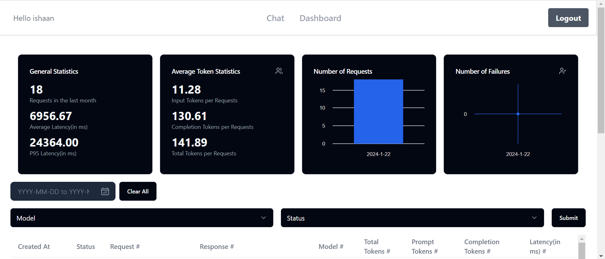

<a name="readme-top"></a>


<h3 align="center">
	    OpenAIDashboard - A prompt response logging system application with detailed metrics 
</h3>


<div style="display: inline-block; background-color: black; padding: 2px; box-shadow: 0 0 10px rgba(0, 0, 0, 0.5);">
    
  </div>

<!-- TABLE OF CONTENTS -->
<details>
  <summary>Table of Contents</summary>
  <ol>
    <li>
      <a href="#about-the-project">About The Project</a>
      <ul>
        <li><a href="#built-with">Built With</a></li>
      </ul>
    </li>
    <li>
      <a href="#getting-started">Getting Started</a>
      <ul>
        <li><a href="#prerequisites">Prerequisites</a></li>
        <li><a href="#installation">Installation</a></li>
      </ul>
    </li>
    <li><a href="#backend-folder-structure">Backend Folder Structure</a></li>
    <li><a href="#frontend-folder-stucture">Frontend Folder Structure</a></li>
    <li><a href="#roadmap">Roadmap</a></li>
    <li><a href="#contact">Contact</a></li>
  </ol>
</details>


## About the Project

OpenAIDashboard is a comprehensive system built to facilitate prompt-response logging and analytics, for interactions with OpenAI models. This project encompasses a backend server developed using Typescript and the NestJS framework, integrated with a ClickHouse database for efficient logging and retrieval of request data. The system also features a user-friendly dashboard, designed to showcase metrics, filter and analyze requests, and provide insights into the performance of OpenAI models.


### New Features

#### User Authentication

OpenAIDashboard now includes user authentication, allowing users to sign up and log in securely. This feature ensures that only authorized users can access and interact with the system. This also allows users to view their own requests and metrics, and prevents them from viewing requests made by other users.

#### Chat Interface

The chat interface mimics the GPT-like conversation experience, where users can create new conversations, input prompts, and select specific OpenAI models for generating responses. This dynamic and user-friendly interface enhances the overall user experience and flexibility in interacting with OpenAI models.


### Built With

* [![NestJS][Nest.js]][Nest.js-url]
* [![ClickHouse][ClickHouse]][ClickHouse-url]
* [![TypeScript][TypeScript]][TypeScript-url]
* [![Next][Next.js]][Next-url]
* [![TailwindCSS][TailwindCSS]][TailwindCSS-url]
* [![Docker][Docker]][Docker-url]


<p align="right">(<a href="#readme-top">back to top</a>)</p>


<!-- GETTING STARTED -->
## Getting Started

Follow these instructions to set up and run the project locally on your machine.

### Prerequisites

- Docker: You will need Docker installed on your machine to run this project. You can download and install Docker from [here](https://www.docker.com/products/docker-desktop).


### Installation

1. Clone the repository:

    ```bash
    git clone https://github.com/mittal-ishaan/prompt-logger
    ```

2. Navigate to the project directory:

    ```bash
    cd prompt-logger
    ```

3. Set up your environment variables:

   This project requires certain environment variables to run correctly.These variables are listed in the `.env.example` file in the root directory of both the backend and frontend parts of the project.

   Create a new file named `.env` in the root directory of both the backend and frontend. Then, copy the contents of the `.env.example` file into the new `.env` file. Replace the placeholder values with your actual values for each environment variable.


#### Backend
5. Navigate to the backend directory:

    ```bash
    cd prompt-logger-backend
    ```

6. Run the docker-compose file:

    ```bash
    docker-compose up
    ```
    This will start the backend server

#### Frontend
7. Navigate to the frontend directory:

    ```bash
    cd prompt-logger-frontend
    ```
8. Run the docker-compose file:

    ```bash
    docker-compose up
    ```
    This will start the frontend server


<p align="right">(<a href="#readme-top">back to top</a>)</p>

## Backend Folder Structure
```
prompt-logger-backend:.
├───src
    │   app.module.ts
    │   main.ts
    │
    ├───auth
    │       auth.module.ts
    │       auth.service.spec.ts
    │       auth.service.ts
    │       constants.ts
    │       jwt-auth.guard.ts
    │       jwt.strategy.ts
    │       local-auth.guard.ts
    │       local.strategy.ts
    │
    ├───controller
    │       app.controller.ts
    │       auth.controller.ts
    │       conversation.controller.ts
    │       openAI.controller.ts
    │
    ├───db
    │   │   click-house.service.ts
    │   │   config.mjs
    │   │   database.module.ts
    │   │   database.providers.ts
    │   │
    │   └───models
    │           chats.ts
    │           conversations.ts
    │           user.ts
    │
    ├───decorators
    │       UserParam.ts
    │
    ├───dtos
    │       ConversationsDto.ts
    │       FilterOptionsDtos.ts
    │       GetChatCompletionDto.ts
    │       SignUpDto.ts
    │
    ├───interceptor
    │       exception.filter.ts
    │       logger.interceptor.ts
    │
    ├───services
    │       app.service.ts
    │       chat.service.ts
    │       conversation.service.ts
    │       openAI.service.ts
    │       stats.service.ts
    │
    ├───types
    │       UserType.ts
    │
    ├───users
    │       users.module.ts
    │       users.service.spec.ts
    │       users.service.ts
    │
    └───utils
            utils.ts
|  .env.example
|  .gitignore
|  docker-compose.yml
|  Dockerfile
|  README.md
```


## Frontend Folder Stucture
```
prompt-logger-frontend:.
├──public
└──src
    ├───app
    │   │   favicon.ico
    │   │   globals.css
    │   │   layout.tsx
    │   │   page.tsx
    │   │
    │   ├───dashboard
    │   │       page.tsx
    │   │
    │   ├───login
    │   │       page.tsx
    │   │
    │   └───signup
    │           page.tsx
    │
    ├───components
    │   │   chat.tsx
    │   │   dashboard.tsx
    │   │   dashstats.tsx
    │   │   logout.tsx
    │   │   navbar.tsx
    │   │   sidebar.tsx
    │   │
    │   ├───icons
    │   │       CollapseIcon.tsx
    │   │       UsersIcon.tsx
    │   │
    │   └───ui
    │           button.tsx
    │           card.tsx
    │           input.tsx
    │           label.tsx
    │           select.tsx
    │           table.tsx
    │
    ├───context
    │       HomeContext.tsx
    │
    └───lib
            utils.ts

|  .env.example
|  .gitignore
|  Dockerfile
|  next.config.js
|  package.json
|  package-lock.json
|  README.md
|  tailwind.config.js

```

<!-- ROADMAP -->
## Roadmap

- [x] User Authentication
- [x] Chat Interface
- [x] Connect with ClickHouse
- [x] Conversation Feature
- [x] User Dashboard
- [x] User Metrics and filters
- [ ] Streamable response


<p align="right">(<a href="#readme-top">back to top</a>)</p>


<!-- CONTACT -->
## Contact

Ishaan Mittal
- [LinkedIn](https://www.linkedin.com/in/ishaan-mittal-2b1b3b1b2/)
- [Github](https://www.github.com/ishaanmittal2000)

Project Link: [https://github.com/mittal-ishaan/prompt-logger](https://github.com/mittal-ishaan/prompt-logger)

<p align="right">(<a href="#readme-top">back to top</a>)</p>

[Next.js]: https://img.shields.io/badge/next.js-000000?style=for-the-badge&logo=nextdotjs&logoColor=white
[Next-url]: https://nextjs.org/

[TailwindCSS]: https://img.shields.io/badge/tailwindcss-38B2AC?style=for-the-badge&logo=tailwind-css&logoColor=white
[TailwindCSS-url]: https://tailwindcss.com/

[python]: https://img.shields.io/badge/python-3776AB?style=for-the-badge&logo=python&logoColor=white
[python-url]: https://www.python.org/

[Docker]: https://img.shields.io/badge/docker-2496ED?style=for-the-badge&logo=docker&logoColor=white
[Docker-url]: https://www.docker.com/

[Nest.js]: https://img.shields.io/badge/nestjs-E0234E?style=for-the-badge&logo=nestjs&logoColor=white
[Nest.js-url]: https://nestjs.com/

[ClickHouse]: https://img.shields.io/badge/clickhouse-000000?style=for-the-badge&logo=clickhouse&logoColor=white
[ClickHouse-url]: https://clickhouse.tech/

[TypeScript]: https://img.shields.io/badge/typescript-007ACC?style=for-the-badge&logo=typescript&logoColor=white
[TypeScript-url]: https://www.typescriptlang.org/

